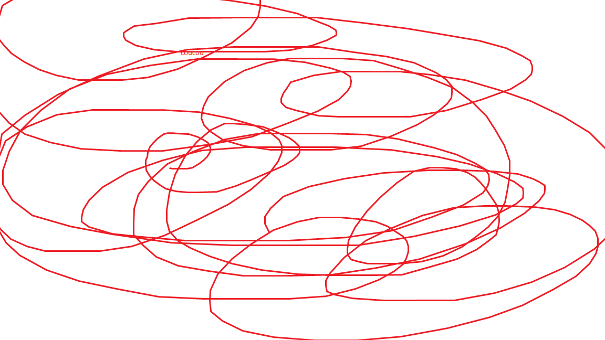

# Premier essai: 1-Premi-re-Page---2-me-et-3-me

## à faire

- Chrome Dev console F12
- 
- 
 -
- [Font](https://www.pagecloud.com/blog/how-to-add-custom-fonts-to-any-website)
- Javascript
- auto-refresh: Live server

- Server
  - HTTP
  - Python
      python -m pip install flask
      python main.py
      Python 3.9
      Flask: serveur web
      Moesif CORS
  - SQLite: base de données
  - JSON
      

## tests divers

C'est mon _projet_.

It's very easy to make some words **bold** and other words *italic* with Markdown. You can even [link to Google!](http://google.com)

# This is an <h1> tag
## This is an <h2> tag
###### This is an <h6> tag

* Item 1
* Item 2
  * Item 2a
  * Item 2b

qsdnfisdfin
